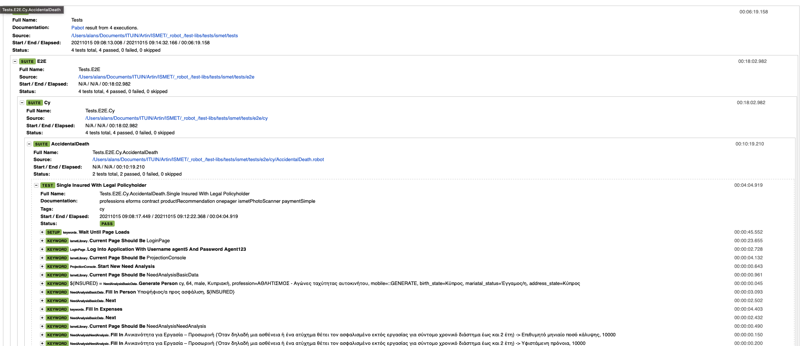

# Robot framework

---

## Robot framework about
- Robot Framework is a generic open source automation framework. It can be used for test automation and robotic process automation (RPA).

- Robot Framework has easy syntax, utilizing human-readable keywords

- Keyword driven approach to testing

- You can find all the information at [Robot Framework homepage](http://www.robotframework.org)

---
# Performance testing

---

- primary used for acceptance testing
- there are tools that can be used for performance testing
  - [RFSwarm](https://iwconnect.com/load-testing-with-robot-framework-swarm/)
  - [RFMetrics](https://github.com/adiralashiva8/robotframework-metrics)

---

# Robot Framework Log file

- time is agreggated at every level

