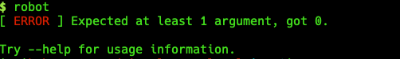

# PIP

---

## PIP about

- recursive acronim for `Pip Installs Packages`
- used for installation of external or local packages
- Install packages from [PyPI](https://pypi.org) (Python Package Index)

---

## Most common usage

| Command | Meaning |
| ------- | ------- | 
| `pip install <package_name>` | installs package <package_name> from PyPI repository | 
| `pip install .` | installs current directory | 
| `pip install . --develop` / `pip install -e .` | installs actual directory as develop mode |
| `pip freeze` | list of all installed packages with their versions |

---

## Installation of Robot Framework

```
pip install robotframework
```

- this will install the latest robot framework version with all required dependencies
- detailed install instruction can be found [here](https://github.com/robotframework/robotframework/blob/master/INSTALL.rst)


## Validation of installation

```
robot
```

ERROR message must be shown:

